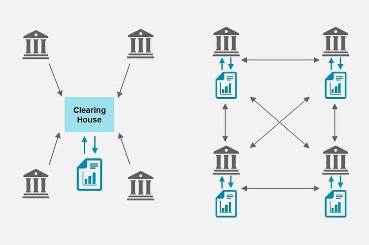
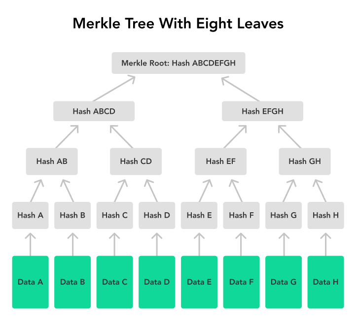
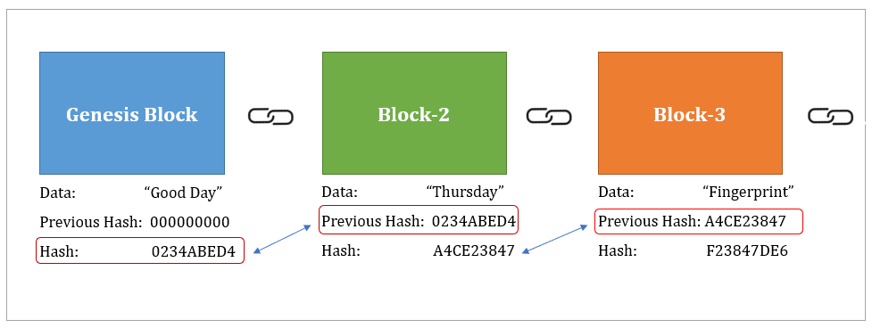
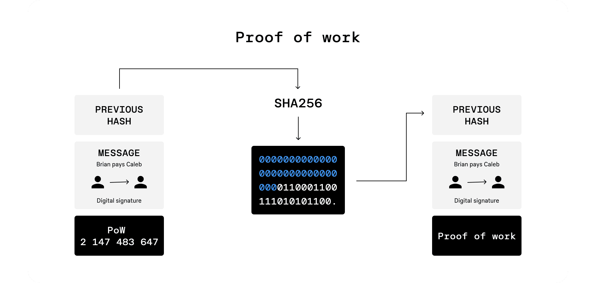

# toy-blockchain

> Masoud Heidary  
**Couse:** Cybersecurity ECE @ University of Houston  
Apr 16, 2025  

> A simplified blockchain project inspired by Bitcoin, built for a Cybersecurity course at the University of Houston.


## About the Project 📚 

This C++ implementation demonstrates the key elements of a blockchain:
- **Proof-of-Work (PoW)**
- **SHA-256 Hashing**
- **Merkle Tree Root**
- **Immutable chain structure**
- **Fixed 10 transactions per block**

The goal is to showcase blockchain principles that support **data integrity**, **tamper resistance**, and **trustless verification**, all of which are critical in cybersecurity.

# How to Build & Run 🔧
To compile and run the code, make sure OpenSSL development libraries are installed:
```console
sudo apt install libssl-dev
g++ -o main main.cpp -lssl -lcrypto
./main
```

## Abstraction

This project demonstrates a simplified implementation of a blockchain system in C++, incorporating essential components such as transactions, blocks, Merkle trees, proof-of-work mining, and chain validation. The goal is to provide a hands-on understanding of blockchain data structures, cryptographic integrity, and consensus mechanisms without relying on external blockchain frameworks.

Each block in the chain contains multiple transactions and is mined based on a defined difficulty level requiring a hash with a specified number of leading zeros. The simulation validates the core principle of blockchain immutability: once a block is added to the chain, any modification to its contents invalidates the block and all subsequent blocks, unless they are re-mined — a computationally expensive process. By modifying a single transaction in an intermediate block, we highlight the cascading failure in hash linkage, Merkle root integrity, and overall chain validation.

This work serves as an educational tool to illustrate how blockchain maintains data integrity, resists tampering, and enforces trust in decentralized systems through cryptographic proofs.

## Introduction

This project was developed as part of the Cybersecurity course at the University of Houston to explore the core cryptographic principles that underpin modern blockchain systems. The objective was to build a simplified, educational version of a blockchain in C++, inspired by the foundational ideas of Bitcoin.

The implementation focuses on three key areas critical to blockchain integrity and security:  
- Cryptographic Hashing (SHA-256): Ensures data immutability and block linkage.
- Merkle Trees: Efficiently represent and verify the integrity of transactions within a block.
- Proof-of-Work (PoW): Simulates computational difficulty to secure new block creation.

Each block in the chain is constructed with a fixed number of ten transactions, mimicking real-world batching mechanisms, and contains the block’s hash, previous block hash, and a Merkle root of its transactions. By mining blocks and linking them cryptographically, the project illustrates how any change to historical data renders the chain invalid — a core security feature of blockchain technology.

From a cybersecurity perspective, this project reinforces how blockchain resists tampering, supports data integrity, and builds distributed trust without relying on central authorities. While this is a simplified version, it successfully demonstrates the underlying mechanisms that make blockchain a powerful tool in secure, decentralized systems.


## Blockchain Fundamentals (Background)

In this section, we explore the core building blocks of blockchain technology. These components form the cryptographic and structural foundation that makes blockchain secure, immutable, and relevant to the field of cybersecurity.

### What is Blockchain?

A blockchain is a distributed, append-only data structure that stores information in a chain of blocks. Each block contains a batch of data (typically transactions), along with metadata that links it cryptographically to the previous block. This chain-like architecture ensures that any modification to an earlier block affects all subsequent blocks, making tampering computationally infeasible.

Blockchains are decentralized — no single party has control over the entire chain — and rely on consensus mechanisms to agree on the current state of data. This structure makes blockchains inherently resistant to data modification, which is why they are widely used in secure, trustless environments like cryptocurrencies, digital voting, and supply chain tracking.



### What Is a Merkle Root?

A Merkle root is a single hash that summarizes all transactions in a block by recursively hashing them in pairs until a single digest remains. This is done using a Merkle Tree, a binary tree of hashes where:
- The leaves are the individual hashes of each transaction.
- Each non-leaf node is the hash of its two child nodes.
- The top-most node is the Merkle root.

Merkle roots allow efficient and secure verification of large data sets. In blockchain:
- They allow verification of individual transactions without revealing the full data set.
- They provide integrity guarantees: if even one transaction changes, the Merkle root changes.

This efficiency is particularly important in lightweight clients (e.g., SPV nodes in Bitcoin) that do not download the entire blockchain but still want to verify transaction inclusion.



### Hashing & SHA-256

Hashing is the process of converting arbitrary data into a fixed-size string of characters using a mathematical function called a hash function. Hashes are:

- Deterministic: the same input always gives the same output.
- Non-reversible: you cannot recover the input from the output.
- Collision-resistant: it's hard to find two different inputs with the same output.

In this project, we use SHA-256, a member of the Secure Hash Algorithm 2 family, producing a 256-bit (32-byte) hash. SHA-256 is:

- Widely used in blockchain, especially Bitcoin.
- Considered secure (as of today) against known pre-image and collision attacks.
- Critical for linking blocks, hashing transactions, and computing Merkle roots.

Each block’s identity is based on its SHA-256 hash, which includes key metadata like the previous hash, Merkle root, timestamp, and nonce. Even a one-bit change in the block’s data causes the resulting hash to change drastically — this is known as the avalanche effect.



### Proof-of-Work (PoW)

Proof-of-Work is a consensus algorithm that requires participants (called miners) to perform a certain amount of computational work to add a new block to the chain. This "work" typically involves finding a nonce value such that the resulting hash of the block's header starts with a certain number of leading zero bits (difficulty).

This ensures:
- Blocks cannot be added instantly; time and energy are required.
- Altering a block would require re-mining it and all subsequent blocks.
- The system is resistant to Sybil attacks, where malicious actors try to flood the network with fake identities.

In our project, PoW is implemented by brute-forcing the nonce value until the SHA-256 hash of the block starts with N zeros (e.g., `0000...`), simulating real-world mining difficulty.



### Importance of Immutability in Cybersecurity

In cybersecurity, immutability — the guarantee that once data is written it cannot be altered — is a highly valued property. Blockchain achieves immutability through a combination of cryptographic hashing, Merkle trees, and consensus algorithms like PoW.

This immutability offers several security advantages:

- Tamper detection: Any unauthorized change in historical data breaks the chain.
- Auditability: All actions and changes are permanently recorded and traceable.
- Trustless environments: Participants do not need to trust each other; trust is placed in the protocol.

In the context of this project, the blockchain serves as a miniature secure ledger where transaction history cannot be forged without redoing significant computational work, aligning with the core principles of confidentiality, integrity, and availability (CIA) in cybersecurity.


# Implementation Details: Simple Blockchain in C++

This section details the core implementation of the blockchain project developed for the Cybersecurity course at the University of Houston. The goal was to implement a Bitcoin-like blockchain with fundamental features such as transactions, mining, block validation, Merkle roots, and immutability enforcement.

## Data Structure

### Transaction
Each transaction contains a sender, a receiver, and a transfer amount:

```c++
struct Transaction {
    std::string sender;
    std::string receiver;
    double amount;
};
```

### Block
A block contains a list of transactions, timestamp, previous block's hash, Merkle root, nonce, and current block hash:

```c++
class Block {
    int index;
    time_t timestamp;
    std::vector<Transaction> transactions;
    std::string last_hash;
    std::string markle_root;
    std::string block_hash;
    long nonce;
};
```

### Blockchain
A chain of validated blocks:

```c++
class BlockChain {
    std::vector<Block> blocks;
};
```

## Block Construction
Each block contains exactly 10 transactions.

The block must be mined such that the hash starts with `n` leading zeroes, determined by `MINE_DIFFICULTY`.

Transactions are randomly generated from a pool of names and amounts:
```c++
Transaction get_random_transaction(const std::vector<std::string>& names, int max_amount);
```

## Proof-of-Work Mechanism

Blocks are mined using a simple brute-force method to satisfy difficulty:

```c++
double mine_block() {
    do {
        nonce++;
        block_hash = get_block_hash();
    } while (!is_hash_lead());
}
```

`is_hash_lead()` checks if the hash starts with the correct number of leading zeros.

## Blockchain Validation

The `is_valid()` method in Block ensures:

- Merkle root matches transactions.
- Hash is correctly calculated.
- Hash starts with required leading zeros:

```c++
bool is_valid() const {
    if (markle_root != get_markle_root()) 
        return false;
    if (block_hash != get_block_hash()) 
        return false;
    if (!is_hash_lead()) 
        return false;
    return true;
}
```

The blockchain is also validated as a whole:

```c++
bool BlockChain::is_valid() const {
    for (...) {
        if (!blocks[i].is_valid() || blocks[i].last_hash != blocks[i - 1].block_hash)
            return false;
    }
    return true;
}
```


# Result & Evaluation
We conducted a simulation of a simple blockchain network by creating and mining a chain of 10 blocks, each containing 10 transactions. The mining difficulty was set such that a valid block hash required a prefix of five leading zeros. The following key points summarize the behavior and performance:

## Transaction Generation:
Random transactions between predefined users (e.g., Alice, Bob, Eve, etc.) were generated for each block.
Example:
```console
trasaction [0]: Eve -> Grace: 9.73
trasaction [1]: Bob -> Grace: 4.84
trasaction [2]: Eve -> Heidi: 7.2
trasaction [3]: Frank -> Ivan: 5.2
trasaction [4]: Bob -> Grace: 8.22
trasaction [5]: Eve -> Alice: 9.82
trasaction [6]: Dave -> Eve: 8.13
trasaction [7]: Bob -> Ivan: 5.27
trasaction [8]: Dave -> Alice: 2.81
trasaction [9]: Bob -> Grace: 7.8
```

## Mining Time:


The time to mine each block varied based on the nonce search to meet the hash difficulty.

Example for `#define MINE_DIFFICULTY 5`:
```console
 - Block [0] mined in 1s
 - Block [1] mined in 1s
 - Block [2] mined in 5s
 - Block [3] mined in 3s
 - ...
```

Example for `#define MINE_DIFFICULTY 7`:
```console
 - Block [1] mined in 580s
 - Block [2] mined in 308s
 - Block [3] mined in 719s
 - ...
```

## Chain Sequence

```console
hain Hash sequence:
 - 0000000000000000000000000000000000000000000000000000000000000000 -> 00000bb31d28042367d1a3d9b2b662bcc9c3bd0fcdcfa0dc05dc8d6a7cf13ca4
 - 00000bb31d28042367d1a3d9b2b662bcc9c3bd0fcdcfa0dc05dc8d6a7cf13ca4 -> 000005fc7d4b66716742cebb74f68f9fbad45cf4d7059dd7eaed4a224dd63b40
 - 000005fc7d4b66716742cebb74f68f9fbad45cf4d7059dd7eaed4a224dd63b40 -> 00000ad2da75e0573f59fe3fd42d5a5cb82acf9fda7ad9417b3062a16410c9b8
 - ...
```


# references
- Wall Street Journal. (n.d.). CIO Explainer: What Is Blockchain? Retrieved from https://www.wsj.com/articles/BL-CIOB-8993

- River. (n.d.). Merkle Tree. Retrieved from https://river.com/learn/terms/m/merkle-tree/

- Metlabs. (n.d.). What is a Hash in Blockchain? Basic Concepts and Characteristics. Retrieved from https://metlabs.io/en/what-is-a-hash-in-blockchain/

- CoinLoan. (n.d.). What is Proof of Work (PoW)? Retrieved from https://coinloan.io/blog/what-is-proof-of-work-pow/

- Nakamoto, S. (2008). Bitcoin: A Peer-to-Peer Electronic Cash System. Retrieved from https://bitcoin.org/bitcoin.pdf